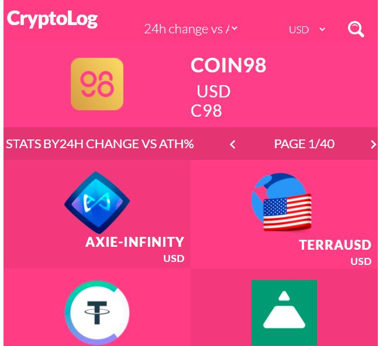

# React Redux Capstone: Catalogue of Statistics 


Users will browse through a list of Crypto Assets, Filtered by Market Cap, ATH, total Volume in higher to lower order. Also, the user can filter by cryptocurrency name.

  

## Screenshot
 </br>


## Live Demo 

[Clic here](https://billo-react-capstone.netlify.app/)

## Built With

- [Node.js]
- [npm](https://www.npmjs.com/)
- [ES6](http://es6-features.org/) 
- [React](https://reactjs.org/)
- [React-DOM](https://reactjs.org/docs/react-dom.html)
- [create-react-app](https://github.com/facebook/create-react-app)
- [React-Redux](https://github.com/reduxjs/react-redux)
- [Redux](https://github.com/reduxjs/redux)
- [PropTypes](https://www.npmjs.com/package/prop-types)
- CSS
- ESLint
- StyleLint


## Packages
- [PropTypes](https://www.npmjs.com/package/prop-types)

## Prerequisities

To get this project up and running locally, you must follow the steps from the [getting started section](#getting-started).

## Getting Started

**To get this project set up on your local machine, follow these simple steps:**

**Step 1**<br>
Navigate through the local folder where you want to clone the repository and run<br>
git clone ` https://github.com/billodiallo/catalogue-of-service.git`. It will clone the repo to your local folder.<br>

**Step 2**<br>
- Cd inside the project

- run npm install

### Run project 

`` npm run start ``

open ```localhost:3000``` in browser. 


## 🤝 contributing

Contributions, issues and feature requests are welcome!

## Author

👤 Billo Dallio

- GitHub: [@billodiallo](https://github.com/billodiallo)
- Twitter: [@BilloDi83547008](https://twitter.com/BilloDi83547008)
- LinkedIn: [Billo Diallo](https://www.linkedin.com/in/mabillodiallo/)

## 🙋‍♂ show your support

give a ⭐️ if you like this project!

## 📝 license


This project is [MIT](LICENSE) licensed.

